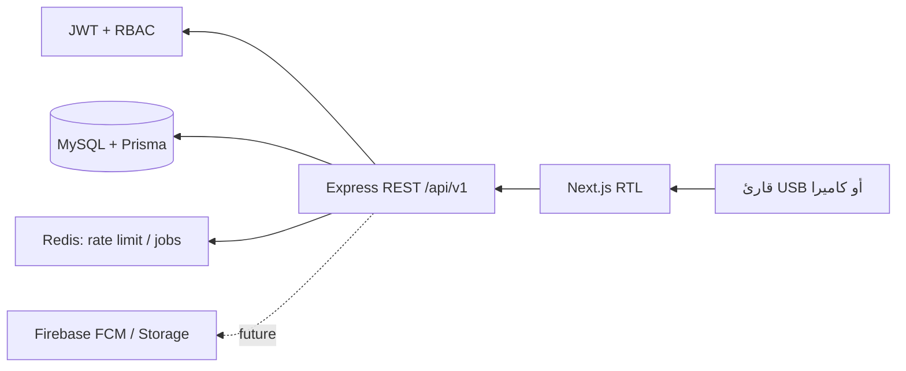

# Architecture

الـ API يطبّق نطاق المدرسة على الخادم، ولا يثق بمعرّف الطالب أو رصيد الفسحة الوارد من العميل. عمليات المال تتم ضمن transaction، ورصيد الفسحة نسخة عملية من دفتر الأستاذ وليس بديلًا عنه.

## مراحل التنفيذ

1. الأساس الحالي: الهوية، RBAC، المدارس/الطلاب/البطاقات في المخطط، رصيد الفسحة وصرف المقصف.
2. CRUD المدارس والطلاب والبطاقات، واجهة المقصف الموصولة بالـ API.
3. تخصيص مبالغ الفسحة، refunds، التقارير، مهام Redis المجدولة، وإشعارات Firebase.
4. اختبارات التكامل والحماية التشغيلية والتصدير.
